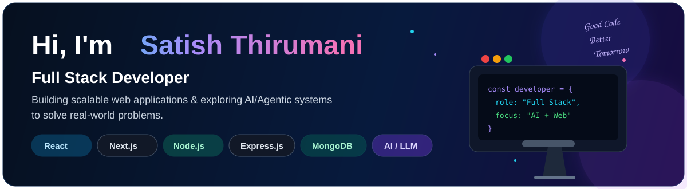
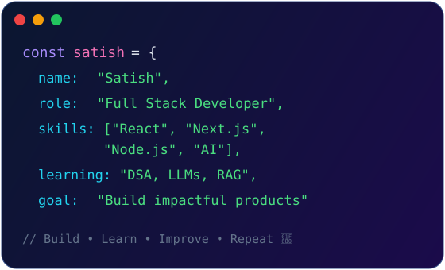
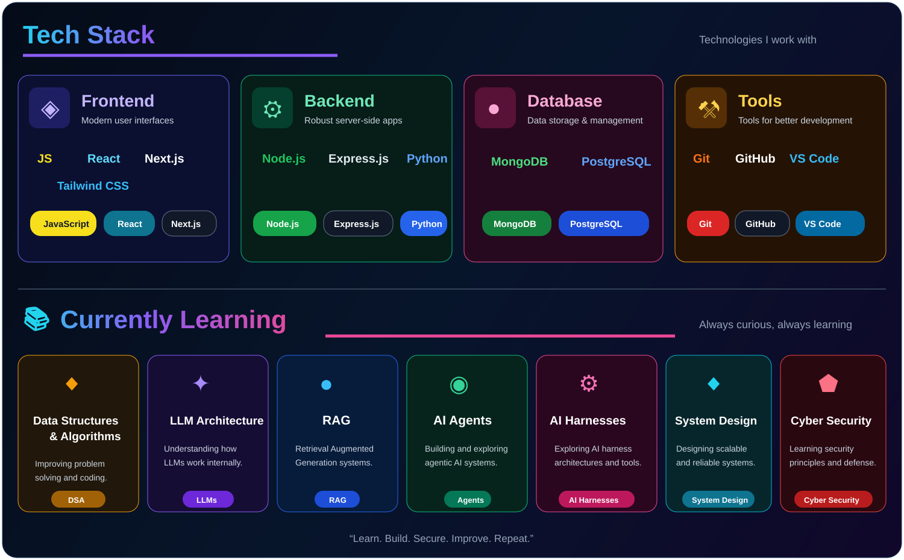
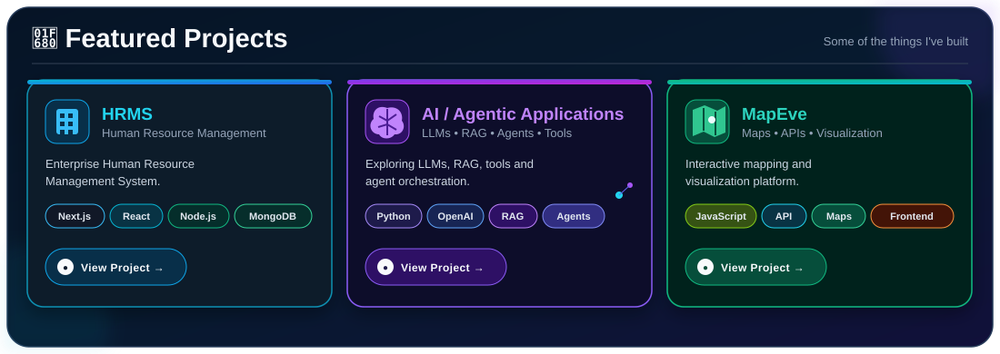

 

---

## 👨‍💻 About Me

<table>
<tr>
<td width="52%" valign="top">

### Full Stack Developer

I'm a Full Stack Developer focused on building modern, scalable and user-focused web applications.

I work primarily with **JavaScript, React, Next.js, Node.js and Express.js**, while also exploring **LLMs, RAG, AI Agents and Agentic AI systems**.

- 🚀 Building full-stack and enterprise applications
- 🏢 Working with HRMS and business applications
- 🤖 Exploring LLMs, RAG and Agentic AI
- 🧠 Improving DSA and problem-solving skills
- 🛠️ Interested in AI harnesses and system design
- 🤝 Open to collaboration and interesting projects

</td>

<td width="48%" valign="top" align="center">

</td>
</tr>
</table>

---

## 🛠️ Tech Stack & Currently Learning

---

## 🚀 Featured Projects

---

## 📚 Currently Learning

---

### 📚 Learning Focus

`Data Structures & Algorithms` · `LLM Architecture` · `RAG` · `AI Agents` · `AI Harnesses` · `System Design` · `Cyber Security` · `Ethical Hacking`

## 🌐 Let's Connect

&nbsp;

&nbsp;

&nbsp;

---

### “Code is like humor. When you have to explain it, it's bad.”

— Cory House

 

